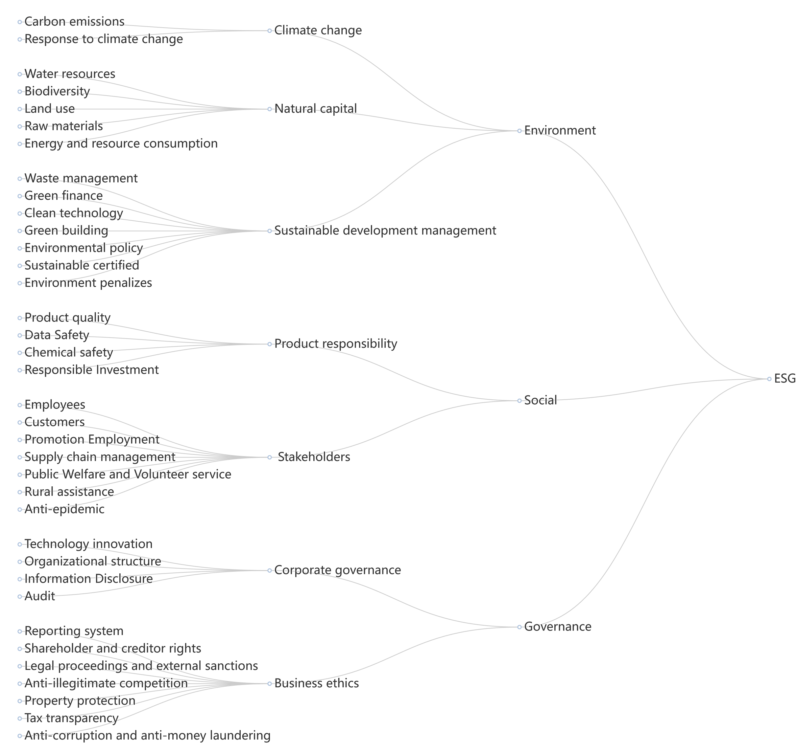

# ESG Multiclass Dataset

Comprehensive ESG dataset from Chinese listed companies' reports. ESG reports serve as an essential platform for companies to disclose their economic, environmental, and social impacts, reflecting their contributions to sustainable development goals. With the increasing demand for corporate transparency, ethical business practices, and sustainable development, ESG reports have gained significant attention from both academia and practitioners.

1. **Environmental (E):** Data related to environmental factors such as carbon footprint, resource usage, and waste management.
2. **Social (S):** Data covering social aspects like labor practices, human rights, and community engagement.
3. **Governance (G):** Data on governance issues such as corporate policies, board diversity, and executive compensation.

## Dataset Description
Annotated Dataset: A total of 8,467 sentences were annotated, each with two labels:
The dataset consists of two core parts: the topic label dataset and the quality label dataset. 

Topic Labels: Classified into 36 different categories, covering various aspects such as climate change, employee health and safety, community engagement, and more.
Specifically:


The ESGTree provides a structured hierarchy of ESG indicators used in the dataset. Each label in the ESGTree is derived from various authoritative institutions, ensuring comprehensive coverage of ESG factors relevant to Chinese annual reports. The detailed sources of each label can be found in source.xlsx.


- Sentence Topic Distribution

The bar chart above represents the distribution of sentence topics across the 36 categories. This visualization helps in understanding the prevalence of each topic within the ESG reports.


Quality Labels: Divided into two categories: "Quantitative Text", "Qualitative Text".

-Sentence Quality Distribution

The bar chart above illustrates the distribution of sentence quality labels within the dataset. It categorizes the sentences into "irrelevant text," "quantitative text," and "qualitative text," with the respective counts for each category.


## File Structure

- **data/**
  - `esgdata.xlsx` - Contains all data points and labels.
- **README.md** - This documentation file.
- **LICENSE** - The license for the dataset.

# Dataset Purpose

The primary purpose of this dataset is to evaluate the completeness of ESG reports. Currently, it is mainly used for ESG classification to measure the completeness of ESG reports. However, this dataset has a broad potential for various other purposes, such as:

- Automated generation and optimization of ESG reports
- Content analysis and trend prediction of ESG reports
- Development of decision support systems for investment
- Evaluation of corporate social responsibility (CSR) strategies
  

## Usage

To use this dataset, you can clone the repository and load the data files into your preferred data analysis environment.

```bash
git clone https://github.com/LCYgogogo/ESG-dataset.git

@dataset{esg_multiclass_2024,
  author    = {Anonymous},
  title     = {ESG Multiclass Dataset},
  year      = {2024},
  url       = {https://github.com/LCYgogogo/ESG-dataset},
}
